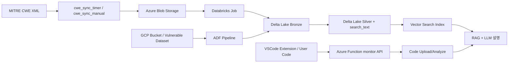

# Azure Databricks를 활용한 소스코드 취약점 자동탐지 및 분석 솔루션

Azure Function + Databricks 기반으로 소스코드 취약점 탐지 파이프라인을 구성하고, CWE 공식 문서 기반 설명 체계를 결합한 보안 지원 프로젝트입니다.  
핵심 방향은 `비생성형 탐지 모델 + RAG/LLM 설명 + XAI 근거 제공 + IDE 연계`입니다.

## 1. 프로젝트 배경

- LLM/Agentic Coding 확산으로 코드 생성 속도는 빨라졌지만, 보안 취약 코드 유입 가능성도 함께 증가
- 취약점 발견 시점이 늦어질수록 수정 비용과 운영 리스크가 급격히 증가
- 보안 전문성이 낮은 개발자도 개발 단계에서 즉시 활용 가능한 저비용 가이드형 솔루션 필요

## 2. 프로젝트 목표

- 소스코드 취약점을 자동 탐지하고 우선순위 기반으로 분석 정보 제공
- MITRE CWE 공식 문서 기반의 근거 있는 설명 제공(RAG 연계)
- 모델 예측 결과에 대한 XAI 기반 의사결정 투명성 확보
- 개발 흐름(특히 VSCode) 내에서 즉시 피드백 가능한 UX 지향

## 3. 핵심 차별점

- 비생성형 탐지 모델로 1차 판별 후, RAG+LLM으로 설명을 분리해 신뢰성 강화
- CWE 공식 문서를 데이터 파이프라인으로 정기 동기화하여 최신성 확보
- XAI(Integrated Gradients, Attention 시각화)로 “왜 취약한지”를 설명 가능
- Azure 기반 E2E 구조로 배포/확장/운영 표준화

## 4. 아키텍처 개요



## 5. 저장소 구현 범위

- Azure Function 엔트리포인트
  - `cwe_sync_timer`: 매일 UTC 00:00 동기화
  - `cwe_sync_manual`: 수동 동기화 API
  - `monitor/upload`, `monitor/scripts`: 코드 업로드/분석 API
- CWE 수집/적재 오케스트레이션
  - MITRE XML zip 확인/다운로드
  - Blob 저장 + 버전 상태 저장
  - Databricks Job 트리거
- Databricks Job 코드
  - Bronze Delta Merge (`databricks_jobs/cwe_delta_merge_job.py`)
  - Silver 변환 + `search_text` 구성 (`databricks_jobs/cwe_silver_transform_job.py`)
- 장애 알림
  - Azure Function 실패 시 Logic App Webhook 알림(`service/alerting.py`)

참고: `service/analyze.py`는 현재 예시 응답 기반의 POC 형태입니다.

## 6. 디렉터리 구조

```text
.
├── blueprint/                 # Azure Function Blueprint (cwe, monitor)
├── service/                   # 오케스트레이션/파서/알림/분석 로직
├── shared/                    # 공통 유틸/스토리지/Databricks 헬퍼
├── databricks_jobs/           # Databricks 실행 Job 스크립트
├── databricks_ai/             # 탐지/XAI/설명 관련 노트북
├── docs/                      # 운영 가이드, 대시보드 문서
├── tests/                     # 단위 테스트
└── function_app.py            # Azure Function App 엔트리포인트
```

## 7. 실행 엔드포인트

### CWE 동기화

- `POST /api/cwe-sync`
  - Query 또는 JSON body의 `force=true` 지원
  - 함수 인증 레벨: `FUNCTION`

### 모니터링/분석

- `POST /api/monitor/upload`
  - Header: `Machine-Id`, `Workspace-Id`
  - Body: `.tar.gz` 바이너리
- `POST /api/monitor/scripts`
  - Header: `Machine-Id`, `Workspace-Id`, `File-Name`, `Print-File(optional)`
  - Body: 코드 텍스트
- `GET /api/monitor/debug/ls?path=...` (ADMIN)
- `GET /api/monitor/debug/run_databricks?num1=10&num2=20` (ADMIN)

## 8. CI/CD

- GitHub Actions: `.github/workflows/main_azure-function-3dt-2nd-5th.yml`
- `main` 브랜치 push 시:
  1. Python 3.13 환경 빌드
  2. 배포 아티팩트(zip) 생성
  3. Azure 로그인 후 Function App 배포

## 9. 기대 효과

- 개발 초기 단계 취약점 식별로 보안 리스크 사전 예방
- 탐지/분석/수정/재검증 비용 절감
- CWE 근거 기반 설명으로 보안 지식 격차 완화
- IDE 중심 워크플로우 통합으로 개발 생산성 향상

## 10. 리스크 및 대응

- 리스크: 모든 언어/취약점 유형을 초기부터 포괄하기 어려움
- 대응: JavaScript + 우선순위 취약점 중심으로 시작해 점진적 확장
- 원칙: 본 솔루션은 최종 판정 도구가 아니라 개발자/보안 담당자 판단을 지원하는 보조 체계

## 11. 향후 발전 방향

- 탐지 모델 정확도 향상 및 다언어 확장
- 최신 CWE/OWASP 반영 자동화 강화
- 반복 취약점 분석 대시보드 고도화
- RAG 기반 수정 제안 기능 확장 및 Hallucination 최소화

## 12. 참고 문서

- Databricks 운영/비용 대시보드 가이드: `docs/databricks-dashboard/cwe-ops-cost-overview/README.md`
- 멀티플랫폼 장애 알림 운영 가이드: `docs/multi-platform-alerting-runbook.md`
- 프로젝트 발표 자료(PDF): `[Dataschool 3기] Azure Databricks를 활용한 소스코드 취약점 자동탐지 및 분석 솔루션`
